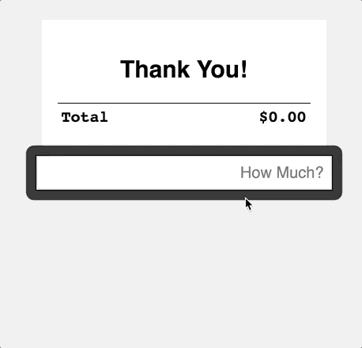

# Cash Register DOM Lab

## Build a cash register app using vanilla javascript and DOM manipulation
> ***Note:*** _This can be a pair programming activity or done independently._

Take a look at the animation above. We're going to build that!

#### Objectives:

1. Target and manipulate DOM elements
1. Capture data from a submitted HTML form
1. Update the DOM with new data
1. Maintain the program's 'state' between interactions

### Testing

> ***Note:*** This exercise includes **unit tests**, so you'll be able to see instantly if your functions work properly by running tests, and passing them.

> Read more: [Test-Driven Development]

### Getting Started

1. Fork this repo into your account.
1. Once the forking is complete, **clone** the repo onto your computer.
1. `cd` into the new folder.
1. From the command-line: 
    - `npm i` (this will get all the tools necessary for this exercise).
    - `git checkout -b solution` to start working on a new solution.
1. Open `js/app.js`
    - Each function and its behavior are described in **each function's comments**.
    - Find all the `TODO: [xx]` comments; they'll describe what to do 
    - All the function names are already inside the file; you just need to implement the function by adding code inside each one.
    - Additionally, you can take a look at the full [function documentation].
1. For best results, have your terminal and your text-editor side-by-side on your screen. It'll help you keep an eye on your progress.

### Writing Code and Running Tests

Run the following command in the Terminal (in this folder):

    npm test 

  - (`ctrl-c` to quit)
  - The tests will initially fail (red).
  - Correct functionality will cause the tests to pass (green).

### Deliverable

When you've completed the lab, 

1. Commit it and push to Github Enterprise. 
2. Create a pull request with your solution.

### Some points to keep in mind 
1. There is no submit button, so pressing `enter` in the input field will submit the form.
1. Keeping track of the total maintains the _state_ of your application. 
1. Commit early, Commit often, git is your friend!
1. Pseudocode! Plan out your project before you write a line of code.
1. Draw pictures! Having a visual representation of your project to work from is super helpful!
1. Keep your functions short and conscise. A function should only do one thing!

## Bonus 1

**There's a bug in the code!** When the user enters a non-numeric value into the field, `NaN` is produced and the program ceases to function properly. 

1. Why is this happening? 
1. How can you validate so the user can only enter numeric data (and decimals)?
1. Will your method work with all _kinds_ of browsers?

## Bonus 2

What are these prices for? What did you buy? Can you add itemizations for each purchase? 

1. Each purchase should have a description on the left side of each price. (The extra `<td>` is already provided for you.)
    1. Does the new description text need to be styled to fit so it aligns left?
1. Make another input field so the user can input the purchase description.
1. Which functions have to change to handle this new information?
1. How does this new field fit into the current design? 
    1. Get creative, but don't redesign it; just make it work in the current design. 

## Additional Resources

1. [Test-Driven Development]
1. [Number.ParseFloat()]
1. [Document.querySelector()]
1. [Event.preventDefault()]

[Event.preventDefault()]: https://developer.mozilla.org/en-US/docs/Web/API/Event/preventDefault
[Document.querySelector()]: https://developer.mozilla.org/en-US/docs/Web/API/Document/querySelector
[Number.ParseFloat()]: https://developer.mozilla.org/en-US/docs/Web/JavaScript/Reference/Global_Objects/Number/parseFloat
[Test-Driven Development]: https://en.wikipedia.org/wiki/Test-driven_development#Test-driven_development_cycle
[function documentation]: docs.md
